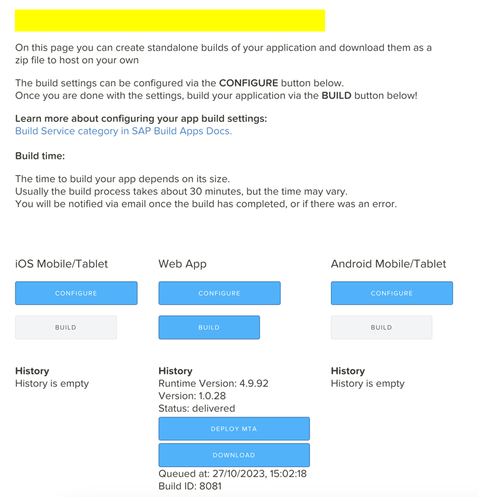

## Running SAP Build Apps application
By following these documented instructions, users will be able to download the reference SAP Build Apps application , deploy and run. \
Please click the link to download the below SAP Build Apps sample application   
 
-  Service form  
-  JobCard 
-  Job Portal  

### How to start
**Step 1:** Open the SAP Build Apps dashboard to import the downloaded  attachment.

Begin by launching the SAP Build Apps Dashboard to initiate the process of importing the downloaded attachment. 
 
**Step 2:** Click the "Import" button to import the downloaded .mtar file. 
 
In this step, you can easily import the downloaded .mtar file. This allows users to reference and check the downloaded file while providing the foundation for creating their unique application. 
 

**Step 3:** Open the imported Build app application (service Form ). 
 
In this step, users have the option to either open an already imported SAP Build Apps application (Service Form) or create a brand new SAP Build Apps application. This flexibility empowers users to design application forms, pages, and more using a diverse range of components, layouts, and elements such as buttons, links, input fields, and more. This allows users to tailor their applications to their specific needs and preferences. 

**Step 4:** Click on "Data" and under data entities, select "Eg : ( VS) " Choose the configured "BTP Destination name." Repeat this step for other data entities as necessary. 
 
In this step, by configuring "BTP Destination," users gain the ability to connect to various data sources, facilitating data processing within their application.  
 
The process of adding BTP Destinations is explained in the "Service" creation steps.  
 
This empowering procedure allows users to efficiently utilize and process data, connecting to different sources as required. It significantly enhances the flexibility and adaptability of their application. 
 
 
**Step 5:** Click the "Launch" button on the top menu. Click "Open Build service" and under "Web App" click "Build" Select ".mtar" , choose the runtime version and enter the app version (e.g., "1.0.0") -  Click "Build" 
 
In this step, users are guided through the process of building and deploying their application. By following these instructions, users can choose different runtime versions and specify the application version (e.g., "1.0.1"). Importantly, users have the flexibility to build their application multiple times with different versions as needed. This step empowers users to prepare their applications for deployment and further usage. 

**Step 6:** After some time, on the same page, once the status changes to "Delivered," click "Deploy MTA.". Follow the popup window and deploy the application. 
 
In this step, users can deploy their application, and once the status changes to "Delivered," they can click "Deploy MTA." Following this, a popup window will guide users through the deployment process. After successfully deploying the application, users will receive the URL. This URL allows end-users to access and utilize the application.

**Step 7 :** Follow the same steps for "Job card" and “Job portal” application  as described above.

**Step 8:** NOTE: When using a BTP destination for a data entity, PATCH requests currently do not work with sub-collection endpoints, such as /parent/{parentId}/child/{childId}. 
 
Workaround Solution: So, when a PATCH request is required with a sub-collection endpoint, try to use a direct HTTP PATCH request instead of a BTP destination. 
 
Example: In the "Job portal" sample application, please refer to the Submit / Start / Complete button component event flow. 

 

