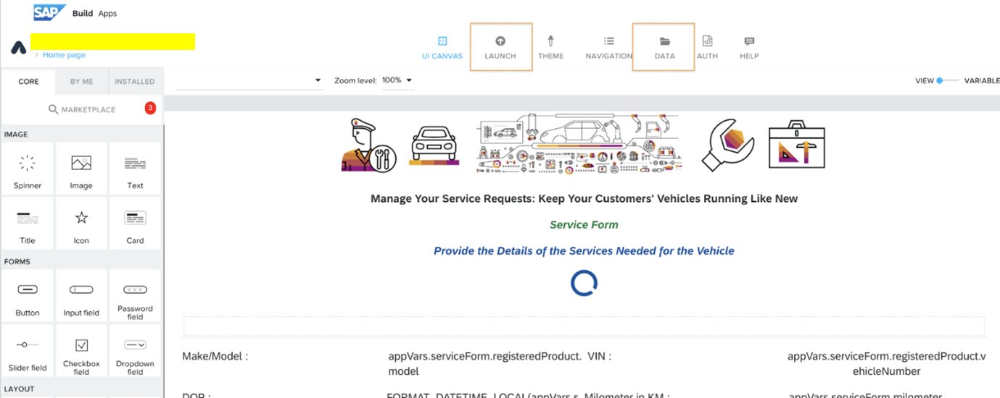
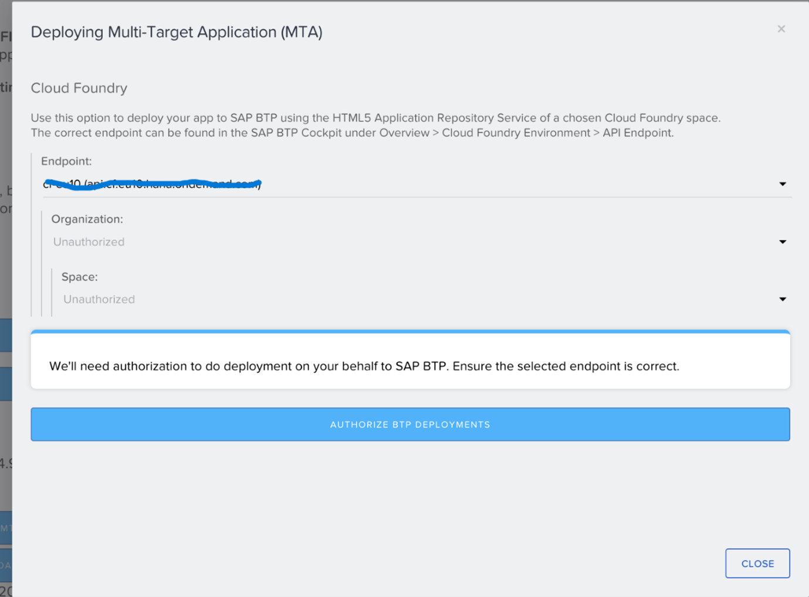
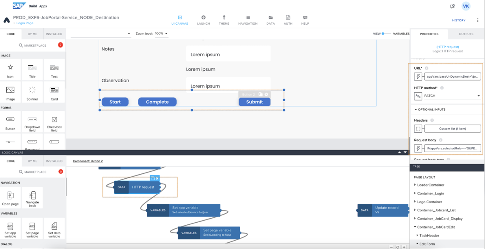

## Running SAP Build Apps application

SAP Build Apps application – a powerful low-code development platform designed for both business users and professional developers.

Below build apps applications serves as a user-friendly UI interface for a vehicle-service management system. The Build Apps sample application empowers customers to effortlessly create service forms, job cards, and a job portal for various job-card related services, all without the need for coding.

The applications seamlessly integrates with different backend services such as JAVA and Node.js. Users can easily switch and connect to their preferred backend service within the Build Apps application by adjusting the destination in data entities.

### Application Overview
 
**Personas**:
- **Service Advisor** : Can create service forms, Job Cards, and download invoices.
- **Service Supervisor** :Has access to the Job Portal.Can assign technicians and add service notes.
- **Service Technician** : Can access Job Cards. Responsible for starting and completing services, such as oil changes and brake replacements.

The Vehicle-service management applications is designed to efficiently manage vehicle services for customers who own vehicles such as cars. The primary objective is to facilitate service requests based on mileage.

**Service Form - Application**:

Upon a customer's service request, a case is created. The service advisor utilizes the "Service Form" application, suggesting services such as oil change and brake replacement based on mileage. Additional details and customer complaints can be added to create a comprehensive service form. Once all information is input, the service advisor generates a Job Card.

**Job Card - Application**:

In this application, After the Job Card is created, the service advisor can view and download the invoice within the "Job Card" page of the same case. The invoice is generated once all services are completed.

**Job Portal- Application**:

This application displays a list of Job Cards and is accessible by both the service supervisor and service technician. The service supervisor can assign job card services to different technicians. Technicians can pick up job cards, perform the required services, update tasks, and mark them as complete.

Once all services, such as brake replacement or oil change, are finished, the job card status is updated in  the sales and service cloud. Within the Job Card, the service advisor can download the invoice and present it to the customer.

### How to run Build Apps Application

For a step-by-step guide on starting, building, and deploying the Build Apps application, refer to the following application and documentation 

***Please click the link to download the below SAP Build Apps sample application***  
 
-  [Service form](../BuildApps/PROD_Service_Form_NODEJS.mtar)  
-  [Job Card](../BuildApps/PROD_EXFS-DISPLAY-JOBCARD_NODEJS.mtar)  
-  [Job Portal](../BuildApps/PROD_EXFS-JobPortal-Service_NODE_Destination.mtar)   
 
### How to run
**Step 1:** Open the SAP Build Apps dashboard to import the downloaded  attachment.

Begin by launching the SAP Build Apps Dashboard to initiate the process of importing the downloaded attachment. 
 
**Step 2:** Click the "Import" button to import the downloaded .mtar file. 
 
In this step, you can easily import the downloaded .mtar file. This allows users to reference and check the downloaded file while providing the foundation for creating their unique application. 
 

**Step 3:** Open the imported SAP Build Apps application (service Form ). 
 
In this step, users have the option to either open an already imported SAP Build Apps application (Service Form) or create a brand new SAP Build Apps application. This flexibility empowers users to design application forms, pages, and more using a diverse range of components, layouts, and elements such as buttons, links, input fields, and more. This allows users to tailor their applications to their specific needs and preferences. 

**Step 4:** Click on "Data" and under data entities, select "Eg : ( VS) " Choose the configured "BTP Destination name." Repeat this step for other data entities as necessary. 

In this step, by configuring "BTP Destination," users gain the ability to connect to various data sources, facilitating data processing within their application.  
 
The process of adding BTP Destinations is explained in the "Service" creation steps.  
 
This empowering procedure allows users to efficiently utilize and process data, connecting to different sources as required. It significantly enhances the flexibility and adaptability of their application. 
 
Here, for the data entity, we can choose from various destinations configured with different platforms, such as Java or Node.js, as mentioned in the "backend service" steps.
 
**Step 5:** Click the "Launch" button on the top menu. Click "Open Build service" and under "Web App" click "Build" Select ".mtar" , choose the runtime version and enter the app version (e.g., "1.0.0") -  Click "Build" 
 
In this step, users are guided through the process of building and deploying their application. By following these instructions, users can choose different runtime versions and specify the application version (e.g., "1.0.1"). Importantly, users have the flexibility to build their application multiple times with different versions as needed. This step empowers users to prepare their applications for deployment and further usage. 

**Step 6:** After some time, on the same page, once the status changes to "Delivered," click "Deploy MTA.". Follow the popup window and deploy the application. 
 
In this step, users can deploy their application, and once the status changes to "Delivered," they can click "Deploy MTA." Following this, a popup window will guide users through the deployment process. After successfully deploying the application, users will receive the URL. This URL allows end-users to access and utilize the application.

**Step 7 :** Follow the same steps for "Job card" and “Job portal” application  as described above.

**Step 8:** NOTE: When using a BTP destination for a data entity, PATCH requests currently do not work with sub-collection endpoints, such as /parent/{parentId}/child/{childId}. 
 
Workaround Solution: So, when a PATCH request is required with a sub-collection endpoint, try to use a direct HTTP PATCH request instead of a BTP destination. 
 
Example: In the "Job portal" sample application, please refer to the Submit / Start / Complete button component event flow. 

 

