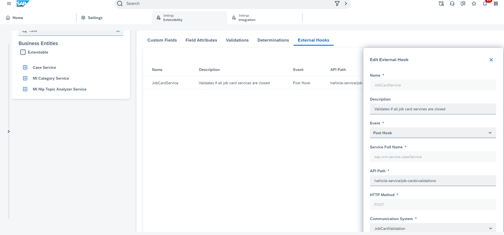

## Validations via External hooks

External API hooks provide the option where customers can implement custom validations & determinations externally

Please refer this help **todo-add help doc link** document for details on external hooks and how it can be configured.

We have implemented validation in our service. 

**Validation Scenario** - If any user is changing the case status to closed/completed, we are validating if tasks are completed by technicians or not. If tasks are not completed, which means case status is not- service completed, we are not allowing, case to be closed in SSC.

To acheive this follow these steps:

* Create API for performing validation - Refer to code in *job-card.controller.ts*
We have exposed end point like this:

    @Post('/validations') 
    
    findValidationStatus(@Body() body) { 
           return this.jobCardService.findValidationStatusService(body);
            }

validation logic is written findValidationStatusService method. 

* Once API is created and validation logic is written, create communication system in Sales and Service Cloud
  * Enter DisplayID 
  * choose outbound configuration
  * Give Host Name. How to get hostname is explained already in "Running backend API using postman" step of "Run Backend service".
  * In authentication Method, enter - "OAUTH_2_CLIENT_CREDENTAILS" . We choose method as authentication is enabled for our APIs.
  * Enter CliendId ,Client Secret, TokenURL. How to get these is already explained in step- "Download and deploy service in Kyma" of "Run Backend service".

* Once this is done, configure external hooks for entity.For this reference implemenation , we need to enable for "case" entity. To enable, goto user menu->settings-> extensibility Administration-> Case Service-> case. 
Under external hooks tab, create External hooks. Enter below details:
  * Name
  * Description
  * Event - Post Hook ( since this is relevant for our validation scenario)
  * API Path - relative path
  * Communication system , which was created in previous step.

  Refer below screenshot as well:
  
