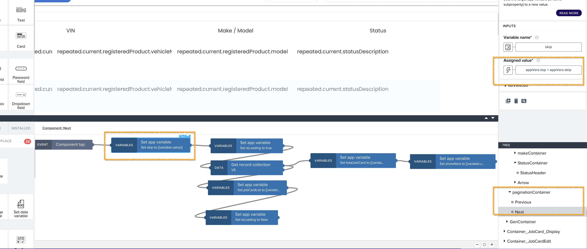

## Pagination
In the JobCard Portal page, we have implemented pagination. Pagination is primarily client-driven i.e., the client has to request for the pages from the API and the API responds accordingly. Following query parameter is used for pagination:

| Query Parameter | Description                                                  |
| --------------- | ------------------------------------------------------------ |
| $top            | Indicates page size. <br />**Default Page Size**: 30<br />
| $skip           | Indicates offset (number of items). For e.g. if page size is 100 and the user is navigating to 10th page, then offset ($skip) would be 900 (9 * 100) |

Example: 

```
Retrieve first page of JobCards
GET /job-cards?$top=20

Retrieve 10 page of JobCards
GET /job-cards?$top=20&$skip=180
```

To see the pagination implementation, please see the findAll() method in "src/extension-modules/job-card/job-card.controller.ts". "$top", "$skip" query params are passed to the service layer, from where, the same gets passed to the db as a query.

## Build apps - Pagination
In Build apps, when the user clicks the "Next" button, the "skip" value is incremented by the value of "top". For example, if "top" is set to 10, the initial "skip" value is 0, and the first page with the first 10 records will be displayed. By clicking the "Next" button, the "skip" value is increased by 10, so the next 10 records will appear.

Similarly, when the user clicks the "Previous" button, the "skip" value is decremented by the value of "top". This will display the previous 10 records.

API : /destinations/0001_VehicleService_NODE_PROD/job-cards?$search=KH123&$top=10&$skip=0




This is the basic mechanism for implementing pagination. In the case of the Jobportal application, the "top" and "skip" parameters should be passed with their respective values to the API mentioned above in order to retrieve a limited number of records as per the request
