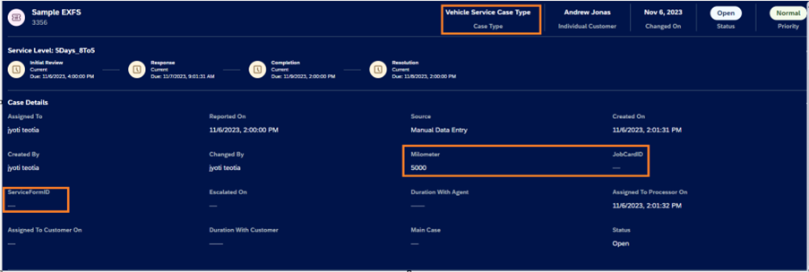
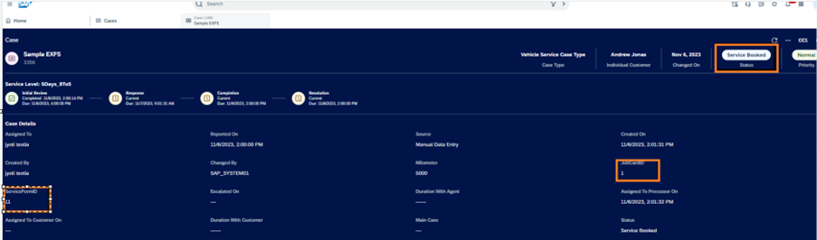
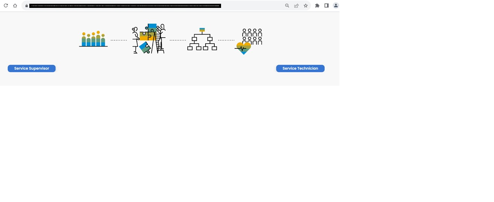
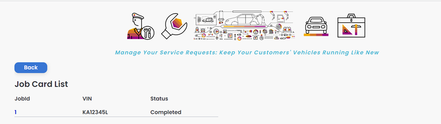
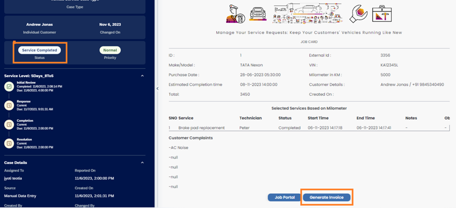
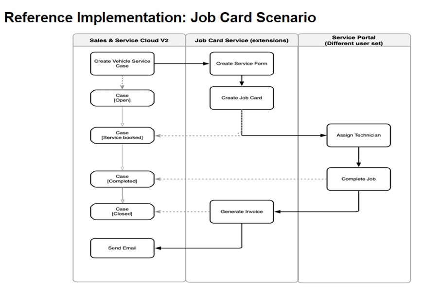

## Reference Scenario
### Scenario
Please find the details of reference scenario in this section.

Case is created by Service Advisor(CNS user) in Sales are Service Cloud, when customer requests for vehicle service.The case is created with custom case type, in this example- “Vehicle Service Case Type”.  Service Advisor captures information like- Individual customer, registered product(standard fields), along with milometer reading of vehicle(this is extension field in case). Registered product is also extended by adding vehicle Number(VIN) extension field.
 

Now, In SSC case, service advisor will fill service Form and create Job Card. This service Form is external application created using build apps and is embedded as mashup in one of tab of case. Please see the image below :
 

Here, as you can see, this Service Form shows data from CNS such as- vehicle number, DOP, milometer. 
Now, based on milometer , services are displayed. Service advisor choose service as per customer request, do some inspection, add notes and create JobCard by clicking on button –“Create JobCard”.
Now job card, can be viewed in one of custom tab as show below. Like service Form, this is also external UI application created via BuildApps.
Here as well, data like customer information is fetched from SSC.
 

Once Job Card is created, Service Form ID and Job Card ID extension fields which are added in case header are updated. Also, case status is changed to “Service Booked”. This is custom status. 
 

As next step- Service Supervisor will login to Job Card portal by clicking on “Job Portal” button in JobCard mashup to assign service technician for various services/tasks of the job card. Please see image below of external application which is also created using buildApps. 
 

 

Now, technician will login to job card portal and start the task/service. Technician can add some notes as well. Once service is started, the status of associated case in CNS is also set to “Service In Progress”. This is also custom status. Customer is also notified via email about this. Autoflow is configured is configured for sending emails.
Once all service is completed by technician, job card portal is updated and case status is set to “service completed”.

 

 

Job Card mashup, shows button to generate invoice,as shown above. Once clicked, invoice is generated and is available in case attachment list.
Service Advisor will review and can close the case.

**Validations :** We have also added validations in external application via External hooks feature. Consider the scenario where technicians has not completed the tasks , and service advisor is marking the case status as completed/closed. In this scenario, external validation should triggered and error message should be raised. Please refer the sceenshot below. Here, case status is service booked, and when we try to close the case, error is raised and case status is not changed.
 

### Scenario Diagram
Please refer to diagram below as well to understand scenario implementation done across different applications :

 
