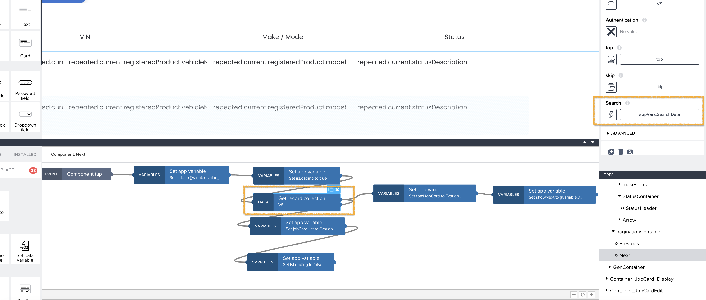
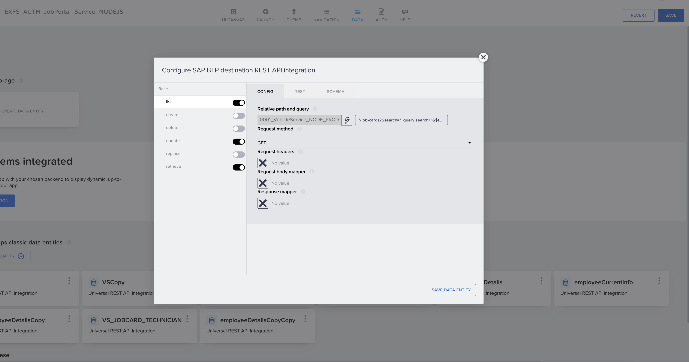
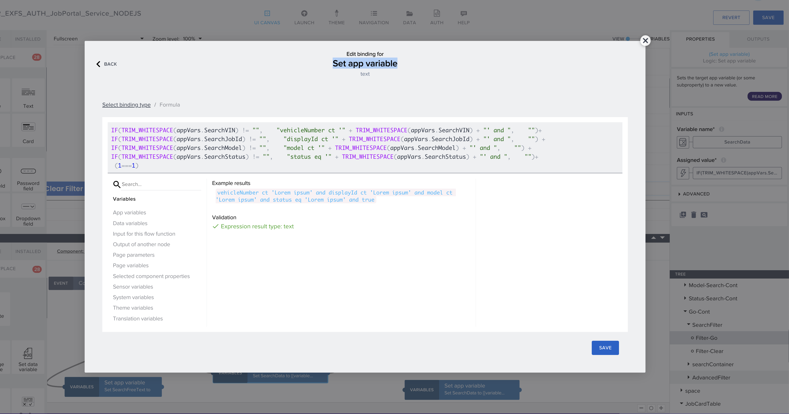

## Search And Filter
In the JobCard portal page, we have added the ability to search/filter JobCards.

## Search 
Query Param used to search within JobCard:

| Query Parameter | Description                                       |
| --------------- | ------------------------------------------------- |
| $search         | Indicates the search expression |

Example

```
Search for `exfs` within JobCards
GET /leads?$search="exfs"
```

To see the implementation of search, please see the function processSearchQuery() in "src/utils/utils.service.ts". In this function, we create the query, which is then passed to the service layer and then to the DB as query. Please note that the search happens only on the following fields:
- displayId
- vehicleNumber
- model
- status\

We do not search in CNS fields because of performance issues.

**Build apps - Search**
In the build apps for the job portal application, there is a feature to search for job cards using free text. This search field allows you to search across all fields such as job card ID, status, and vehicle number. To perform the search, you need to pass the search value to the mentioned API endpoint, and it will return the corresponding results.

API : /destinations/0001_VehicleService_NODE_PROD/job-cards?$search=KH123


 To see the implementation of the Search in the build apps side, please refer below screen.






## Filter


Query Param used to filter JobCard:
| Query Parameter | Description                                                  |
| --------------- | ------------------------------------------------------------ |
| $filter         | Indicates the filter expression |   

Following are the list of operators that are to be supported.

| Filter Operation | Example |
|----|----|
| Equals | `$filter=field1 eq 10` |
| Not equal to | `filter=field1 ne 42` |
| Contains | `$filter=city ct 'Fran'` |
| And | `$filter=field1 eq 'A' and field2 eq 14` |
| Or | `$filter=countryCode eq 'ES' or countryCode eq 'US'` |

To see the implementation of filter, please see the function processFilterQuery() in "src/utils/utils.service.ts". In this function, we create the query, which is then passed to the service layer and then to the DB as query

**Build apps - Filter**
 
In the Build apps - Job portal application, you can also filter the job card list using the filter parameter. This allows you to refine the list based on specific criteria. You can filter job cards based on one or multiple fields. By using the "and" condition in the filter parameter.

API : /destinations/0001_VehicleService_NODE/job-cards?$filter=vehicleNumber ct 'KA' and displayId ct '9' and true


 To see the implementation of the filter in the build apps side, please refer below screen.

 


