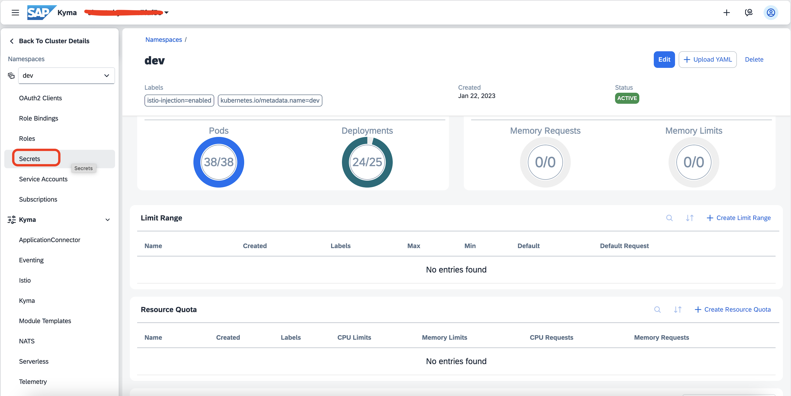
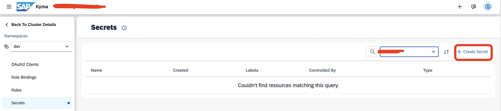
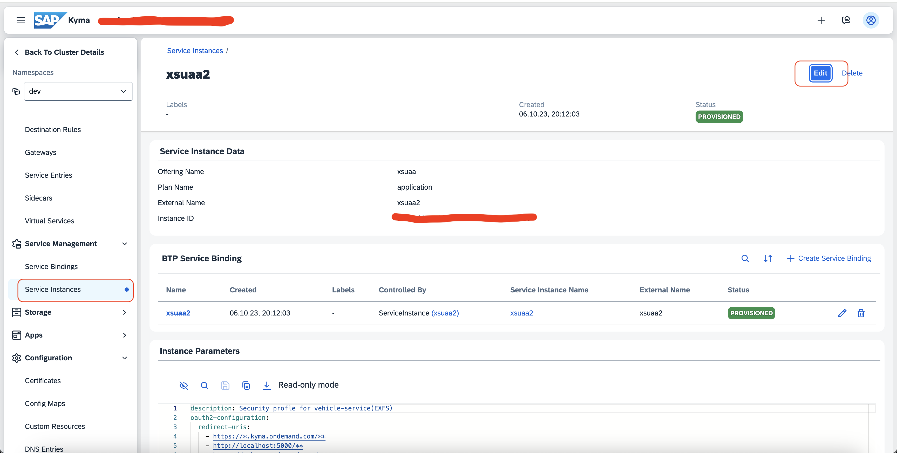
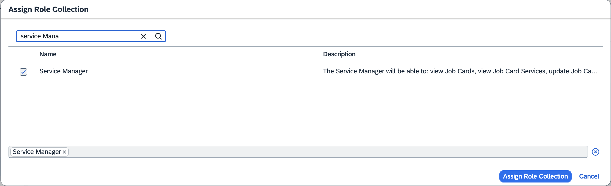
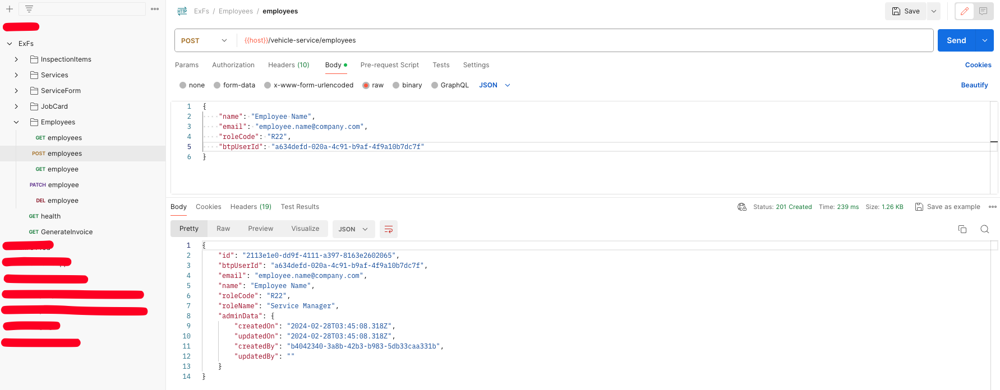
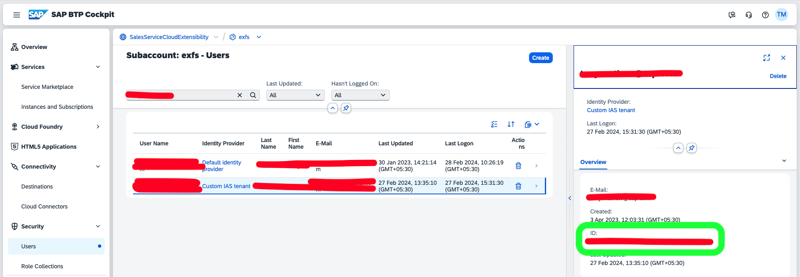

## Node JS Service / Java Service

This application serves as a vehicle-service management system. With this application, the customer can create service-forms, job-cards, and assign technicians to different job-card related services. The customer can see the progress of the services assigned to a technician. When the technician completes all the services assigned to him/her, the customer can generate the final invoice. This service is available in both **Java** and **NodeJs**, allowing users to seamlessly switch between these platforms based on their preferences and requirements.

NodeJs Service can be found here: [NodeJs Service](../nodeJs)

Java Service can be found here: [Java Service](../javaService)

This application is designed to be used to by three personas -
1. **Service Advisor** - A Service Advisor is a professional who acts as a liaison between vehicle owners/customers and the service department of an automotive service center or dealership. Their role is to assist customers with their vehicle service needs.
2. **Service Manager** - A Service Manager is responsible for overseeing and coordinating the operations of the service department. Their roles include assigning the services to technicians, and giving notes to the assigned technicians regarding the service.
3. **Service Technician** - A Service Technician is a professional responsible for diagnosing, repairing, and maintaining vehicles. A Service Manager assigns services to a technician and the technician can update the service, add observation etc

The application uses NestJs Framework and is written in Typescript. To cater to the above functionalities, the application is divided into the following modules:
1. **ServiceForm** - A service form is a document used to record and document details about the specific services or maintenance tasks performed on a vehicle. It includes information such as a list of services suggested/selected, vehicle information, inspection items checklist, list of complaints and notes. This module manages creation, updation and deletion of the ServiceForm Entity.
2. **JobCard** - A Job Card is a document that outlines the scope of work to be done on a vehicle. It serves as a directive for technicians and mechanics, detailing the tasks to be completed during a particular service or repair session. This modules manages the creation, updation and deletion of JobCard Entity. Also manages JobCardService Entity
3. **Cases** - This module manages the connection between case service in CNS
4. **Customer** - This module manages the connection between acccount and individual-customer services in CNS
5. **Registered-products** - This module manages the connection between registered-products service in CNS

Apart from this, we have the following modules which handles all the master data in the application:
1. **Inspection-Items**: Inspection item is a specific task, check, or examination that needs to be performed during a vehicle inspection or service. This modules manages the creation, updation and deletion of Inspection-items Entity.
2. **Services**: A Service typically refers to a specific maintenance or repair activity performed on a vehicle to ensure its proper functioning, safety, and longevity. This module manages the creation, updation and deletion of Services Entity

These are the entities used in the service:
1. Services
2. InspectionItem
3. JobCard
4. JobCardServices
5. ServiceForm
6. Employees

Database used in the application is [SAP HANA](https://www.sap.com/india/products/technology-platform/hana/what-is-sap-hana.html). We use [Typeorm](https://typeorm.io/) (A Object-Relational Mapping (ORM) library) to simplify database interactions using object-oriented programming techniques rather than traditional SQL queries.

The following sections details out how to setup the application and deploy this to Kyma Environment:

## Download and deploy service in Kyma
1. **Download kubeconfig file for kyma from your BTP account**:\
Kubeconfig is a configuration file essential for interacting with Kubernetes clusters. It encapsulates details such as cluster settings, user authentication credentials, and context configurations, enabling users to seamlessly manage multiple clusters. This file facilitates communication between the Kubernetes control plane and nodes, and it is utilized by command-line tools like kubectl to execute commands and switch between clusters. The kubeconfig structure includes sections for clusters, users, contexts, and the currently active context, providing a versatile and user-friendly way to configure and connect to Kubernetes clusters. To download the kubeconfig file:
    * Go to your BTP Subaccount:\
    
    * Go to Kyma Environment -> click on kubeconfigURL. This will download the kubeconfig file:\
    
    * Rename the downloaded file to “config” (without any extension) and depending on the operating system, place the file in the following location:  \
    Mac OS: $HOME/.kube/ (Create .kube directory if not present already)\
    Windows: C:\Users\<user-name>\.kube\ (Create .kube directory if not present already) 

2. Create a namespace called "dev"(You can also create namespace with other names. However, if you create a namespace with a different name, kindly make sure the same name is updated in "vehicle-service.yaml" file in the code). We will be deploying our application to this namespace.

3. Create XSUAA/destination service instances\
Since our application uses destination to connect to services in CNS, we need to create service instance and service binding for both destination and xsuaa. (XSUAA will be used to fetch credentials required to connect to the destination service)
Please refer [this](https://blogs.sap.com/2022/07/12/the-new-way-to-consume-service-bindings-on-kyma-runtime/) to understand how services - destination service and xsuaa service are consumed in an application in kyma.
  * Add the SERVICE_BINDING_ROOT env variable into your deployment: https://github.tools.sap/fp-stakeholder-management/xsuaa-approuter/blob/main/approuter/helm/app1-app/templates/deployment.yaml#L91
  * Create a volume with your dest service binding secret: https://github.tools.sap/fp-stakeholder-management/xsuaa-approuter/blob/main/approuter/helm/app1-app/templates/deployment.yaml#L91
  * Create a volume mount with a path to the binding secret: https://github.tools.sap/fp-stakeholder-management/xsuaa-approuter/blob/main/approuter/helm/app1-app/templates/deployment.yaml#L69 \
  NOTE: Once you create XSUAA instance, a secret will be created which will have details like ClientID, clientSecret, tokenURL etc which will be needed in the following steps. **Kindly give the secret names as "destination-service-binding" and "xsuaa-service-binding" for destination and xsuaa services respectively**

4. Create Destinations in BTP:\
A Destination is a configuration setting used to define how applications or services hosted on the platform can connect to external systems, services, or APIs. In our application, we will be using two destinations:
    * First, used by buildapps to connect the application in kyma:

      
      * **Type**: HTTP
      * **URL**: Application URL
      * **Authentication**: OAuth2JWTBearer
      * **ClientId, ClientSecret, Token Service URL**: You will get this info from the xsuaa instance secret created in the previous step. OAuth2JWTBearer destination type can help exchange the user JWT token into an OAuth2 bearer access token with the required scopes

   To allow an application to call another application, passing the user context, and fetch resources, the caller application(In our case, this is the build apps application) must pass an access token. In this authorization flow, the initial user token is passed to the OAuth server as input data. This process is performed automatically by the Destination service, which helps simplifying the application development: You only have to construct the right request to the target URL, by using the outcome (another access token) of the service-side automation.
    * Second, Used by the application in kyma to connect to service in CNS:
   \
   OAuth2SAMLBearerAssertion authorisation flow allows for propagation of a user’s identity from our application deployed in kyma to the service we are trying to connect in Sales and Cloud Service.
5. Create Hana Database to instance
   * Follow [this](https://blogs.sap.com/2022/12/15/consuming-sap-hana-cloud-from-the-kyma-environment/) to consume HANA Database in Kyma
   * **This will create a Kubernetes secret from where we can get the details required to connect to the Database**
6. Create Kubernetes secrets\
Kubernetes Secrets are a way to manage sensitive information, such as passwords, tokens, and other confidential data, within Kubernetes clusters.

   * To create a secret, go to the Kyma Dashboard and click on secrets:
    
   * Create a Kubernetes secret file(with the name **vehicle-service-secrets**)
    
   * The secret should contain the following:
   * **case_status_booked**: \<*Status code when case status is booked*>
   * **case_status_closed**: \<*Status code when case status is closed*>
   * **case_status_completed**: \<*Status code when case status is completed*>
   * **case_status_service_completed**: \<*Status code when case status service completed*>
   * **case_status_service_in_process**: \<*Status code when case status is service in process*>
   * **db_password**: \<*Database password. This is available in the secret that’s created in the above step*>
   * **db_user**: \<*Database username. This is available in the secret that’s created in the above step*>
   * **destination**: \<*Destination to which the application connects*>
   * **dropSchema**: \<*Drops the schema each time connection is being established. This option is useful during debug and development*>
   * **extension_field_jobcard_id**: \<*Job Card ID extension field*>
   * **extension_field_milometer**: \<*Milometer extension field*>
   * **extension_field_service_form_id**: \<*Service Form ID extension field*>
   * **extension_field_vehicle_number**: \<*Vehicle Number extension field*>
   * **logLevel**: \<*Sets the log level of the application*>
   * **synchronize**: \<*Indicates if database schema should be auto created on every application launch. This option is useful during debug and development*>\
   You will notice this secrets contains IDs for configurations done in sales and service cloud like extension fields, Case status. The reason being different IDs which is generated when fields are created. In our service code, we are refering to IDs maintained here in business logic.

7. Clone the service from - *git@github.com:SAP-samples/sales-and-service-cloud-extensions.git*

8. Prepare Deployment Description File\
   Based on our application specification, we define the following description file for deployment. This yaml file can be found inside 
   - k8s folder, in case of **Node Service** and 
   - within root directory, in case of **Java Service**


      NOTE: In API Rule, we have configured an access strategy to restrict access to the application. We will be using the JWT access strategy to protect endpoint(s) from unsolicited access.

9. Access to a container registry:\
   To store the application image, access to a container registry(eg Docker hub) is required.
    * For **Node Service**
        * The docker-image name has to be filled in the files "VehicleServiceExtensionSample/nodeJs/skaffold.yaml" and "VehicleServiceExtensionSample/nodeJs/k8s/vehicle-service.yaml"(Placeholders are provided in the files)
    * For **Java Service**
        * The docker-image name has to be filled in the files " skaffold.yaml" and "k8s-deployment-backend.yaml"

10. Install dependencies:
    * For **Node Service**
        * Do ```npm install``` in root directory
    * For **Java Service**
        * Do ```mvn clean install```  in root directory

11. Deploy to Kyma cluster using scaffold(Skaffold is an open-source command-line tool developed by Google for automating the development workflow of Kubernetes applications. It aims to simplify the process of building, pushing, and deploying containerized applications on Kubernetes. Read more about Skaffold [here](https://skaffold.dev/))
    * For **Node Service**
        * Use "deploy.sh" (In root directory) to deploy the service to Kyma\
            * This is a script which does two things:
            * Build the application 
            * Run the command ```bash deploy.sh```

    * For **Java Service**
      * Deploying the service to Kyma
          * Build the application – ```mvn clean install```
          * Deploy to Kyma cluster using scaffold – ```scaffold run```

Alternatively, please follow the steps below to deploy your service to Kyma:
* Build the application
*  Build docker image:
To create docker image we use the following docker file(This DockerFile is available in the root directory of the application):

* For **Node Service**


* For **Java Service**<br><br>
  

* Use command - ```docker build -t <docker-hub-account>/<image-name>:v1``` to build docker image based on the above dockerfile.This   command should be run in the same level where the DockerFile is present
*  Push the docker image to a container repository.\
   If you are using docker hub to store the image we created in the previous step:
    * Log in to Docker using this command: ```docker login -u <docker-id> -p <password>```
    * Push the local image into the Docker Hub using command : ```docker push <docker-hub-account>/<image-name>:v1```
    * Deploy the application using the deployment description file created in step 5:\
      ```kubectl -n dev apply -f k8s/vehicle-service.yaml```

## Add Authentication 
This section shows how you can enable authentication for service and achieve user propagation between SAP Sales and Service Cloud and external applications.
* Enable BTP authentication in SAP Buildapps - https://blogs.sap.com/2022/07/01/using-btp-authentication-and-destinations-with-sap-appgyver/
This will create an xsuaa instance in BTP
* Create a destination with the following configuration for the build apps to connect: \

OAuth2JWTBearer destination type can help exchange the user JWT token into an OAuth2 bearer access token with the required scopes \
NOTE:
To get "Client ID", "Client Secret" and "Token Service URL", an XSUAA instance has to be created.\
To create an XSUAA instance, follow [this](https://help.sap.com/docs/btp/sap-business-technology-platform/using-sap-btp-services-in-kyma-environment). Once the service binding is created, it will create a Kubernetes secrets which will have the clientid, client secret and token service URL info.
* To allow an application to call another application, passing the user context, and fetch resources, the caller application(In our case, this is the build apps application) must pass an access token. In this authorization flow, the initial user token is passed to the OAuth server as input data. This process is performed automatically by the Destination service, which helps simplifying the application development: You only have to construct the right request to the target URL, by using the outcome (another access token) of the service-side automation.
* API rule definition for the service deployed in Kyma-
API rule CRD(custom resource definition) can offer a number of access strategies to help restrict access to exposed endpoints. In our case, we will be using the JWT access strategy as a way to protect an API rule endpoint(s) from unsolicited access.
To setup API rule CRD with access strategy:

* With this API rule definition, the application hosted in kyma will have access to the user JWT token.\

## Add Authorization
Authorization is the process of determining what actions or operations a user, application, or system is allowed to perform within a given system or environment. It plays a crucial role in ensuring the security of applications by controlling access to resources and functionalities based on the identity and privileges of the user. [XSUAA](https://www.google.com/search?q=xsuaa&rlz=1C5GCCM_en&oq=xsuaa&gs_lcrp=EgZjaHJvbWUyCQgAEEUYORiABDIGCAEQRRhAMgYIAhBFGDwyBggDEEUYPDIGCAQQRRg8MgYIBRBFGEEyBggGEEUYQTIGCAcQRRhB0gEINTc2N2owajeoAgCwAgA&sourceid=chrome&ie=UTF-8#:~:text=Demystifying%20XSUAA%20in,%E2%80%BA%20ba%2Dp) provides a robust solution for implementing authorization. The `xs-security.json` file is a key component used in XSUAA to define authorization configurations for applications. Within this file, developers can specify various elements such as scopes, role templates and role collections, which collectively determine the access rights granted to users or user groups. By defining these configurations, developers can enforce fine-grained access control within their applications, ensuring that only authorized users can perform specific actions or access certain resources. This centralized approach to authorization management facilitates the implementation of security best practices and helps maintain the integrity and confidentiality of application data. Please check the syntax of `xs-security.json` file [here](https://help.sap.com/docs/btp/sap-business-technology-platform/application-security-descriptor-configuration-syntax).

The `xs-security.json` file used for vehicle-service scenario can be found [here](../nodeJs/security/xs-security.json).

Here's a general overview of how you can implement authorization using XSUAA:

1. **Define Scopes**: Scopes represent specific permissions or access rights within your application. You define scopes in the XSUAA service instance configuration. For example, you might define scopes like read, write, admin, etc., based on the actions users can perform. For vehicle-service scenario, following scopes are defined:
  - "uaa.user": This is required by destination service for token exchange
  - "$XSAPPNAME.CreateJobCard": This scope allows to Create a Job Card
  - "$XSAPPNAME.ViewJobCard": This scope allows to View Job Card
  - "$XSAPPNAME.EditJobCardService": Edit a Job Card Service entity. This scope allows to edit all fields in a Job Card Service
  - "$XSAPPNAME.DeleteJobCard": This scope allows to Delete a Job Card
  - "$XSAPPNAME.CreateServiceForm": This scope allows to Create a Service Form
  - "$XSAPPNAME.ViewServiceForm": This scope allows to View Service Form
  - "$XSAPPNAME.UpdateServiceForm": This scope allows to Update a Service Form
  - "$XSAPPNAME.DeleteServiceForm": This scope allows to generate invoice
  - "$XSAPPNAME.EditTask": This scope allows to edit only two fields in JobCardServices entity - observation and notes. If a user has both `EditTask` and `EditJobCardService` scopes, only `EditJobCardService` will be considered
  - "$XSAPPNAME.MasterData": This scope allows to create, read, update and delete the master data - InspectionItems, Services and Employees
  - "$XSAPPNAME.GenerateInvoice": This scope allows to generate invoice\
  NOTE: [xsappname](https://help.sap.com/docs/SAP_HANA_PLATFORM/4505d0bdaf4948449b7f7379d24d0f0d/6d3ed64092f748cbac691abc5fe52985.html#:~:text=allowedproviders%22%3A%20%5B%22useridp1%22%2C%20%22useridp2%22%5D%20%7D%20%0A%7D-,xsappname,-Use%20the%20xsappname) specifies the name of the SAP HANA XS application to which the security settings apply. It acts as a unique identifier, linking the security rules defined in the file to a specific application.

2. **Define Role Templates**: Role templates group together scopes to define a set of permissions. You define role templates in the XSUAA service instance configuration and associate them with the necessary scopes. For instance, a role template named UserRole might include scopes for reading and writing data. For vehicle-service scenario, following scopes are defined:
  - ServiceAdvisorRole 
  - ServiceManagerRole
  - ServiceTechnicianRole

3. **Define Role Collections**: Role collections group role templates together and assign them to users or user groups. You define role collections in the XSUAA service instance configuration and assign the appropriate role templates to them. For example, you might have a role collection named User that includes the UserRole template.
  - "Service Advisor": The Service Advisor will be able to create, view, update, and delete service forms, view and delete Job Cards, and generate Invoices.
  - "Service Manager": The Service Manager will be able to: view Job Cards, view Job Card Services, update Job Card Services, perform CRUD operations on Inspection Items, Services, and Employees.
  - "Service Technician": The Service Technician will be able to view Job Cards and edit their own Job Card Service. A Technician is only authorized to edit specific fields.

4. Add `xs-security.json` file contents as `Instance Parameters` in the xsuua instance. To add instance-parameters:
      - Go to service instances under Service Management(in dev namespace), click on Edit:
      
      - Add the `xs-security.json` contents created in the previous section under `Instance Parameters`:
      
      - Click on Update.
      - Once the instance parameters is updated with xs-security.json contents, the related roles will get updated in the SAP BTP Cockpit

5. **Assign Roles**: After defining role collections, you assign them to users or user groups. This assignment can be done through the SAP BTP Cockpit. Users or user groups with specific roles have the associated permissions granted by the role templates assigned to their role collections. To assign Role Collections to a user:
    - Go to Users under Security in SAP BTP Cockpit
    - Search for the user, click on "Assign Role Collection":
      
    - Search for the Role Collection that you want to assign to the user:
      
    - Click on "Assign Role Collection"

6. **Creating Employee Master data in the service**: For the application to work properly, you need to replicate Service Manager, Service Technician data in the service. For details regarding the API, refer [here](#create-employeesservice-manager-and-service-technician-users-created-in-btp-should-be-replicated-here).\
This Employee master data is used in the buildApps to determine if the logged in user is Service Manager or Service Technician. Based on the logged in user's role, build apps controls the functionality.

7. **Protect Resources**: In your application code or configuration, you specify which resources require specific roles or scopes for access. This is typically done using authorization mechanisms provided by your application framework or libraries. For more information on how to protect APIs using Guards in Nestjs, check [this](https://docs.nestjs.com/guards).

## Running backend API using postman
Please follow below steps to run the APIs
 * Before testing the APIs, a case of type "Vehicle Service Case Type" needs to be created. In this case, a registered product needs to be added. Also, the extension field "Milometer" should be filled. This is mandatory else the ServiceForm API will fail.\
 Once this case is created, get the Case ID. To get the Case ID:
   * Open Developer Tools
   * Go to network tab
   * Filter by "case"
   * Open a case that satisfies the above conditions
   * The first network call will have the ID:\
   
 *  Get the host of your deployed application: 
    * Go to your BTP subaccount:\
     
    * Go to kyma dashboard:\
     
    * Select your namespace:\
     
    * Go to ApiRule -> select the host for your application:
    
* Running APIs
  * Download the postman collection from [here](../Files/postmanCollection/ExFs.postman_collection.json). This JSON file needs to downloaded and imported to postman.\
   The sample application’s API is protected. This means that a valid JWT token is expected in the request. In postman you can set this authentication by following the below steps.
  * #### Go to collection level authorization and add the following configuration-
  
      * Type:  "OAuth 2.0"<br>
      * grant type - "Authorization Code" <br>
      * callback url - https://<*subdomain*>.launchpad.cfapps.<*region*>.hana.ondemand.com/login/ <br>
      * auth url -  https://<*subdomain*>.launchpad.cfapps.<*region*>.hana.ondemand.com /oauth/authorize?redirect_uri=auth url -  https://<*subdomain*>.launchpad.cfapps.<*region*>.hana.ondemand.com /oauth/authorize?redirect_uri=<br>
      * access token url -  https://<*subdomain*>.launchpad.cfapps.<*region*>.hana.ondemand.com /oauth/token<br>
      * client ID, client Secret: You will get these details in step 1 under [this](#download-and-deploy-service-in-kyma) section  
  * #### Create the following variables in the collection. Use the host from the previous step. No need to fill the other variables.
  
  **NOTE: Master data(Inspection Items, Services and Employees) has to be created first for the application to work correctly**
  * #### Create Inspection Item(Any number of inspection items can be created)
   
  * #### Create Services(Any number of services can be created)
     
  * #### Create Employees(Service Manager and Service Technician users created in BTP should be replicated here)
   
    Note: Role Code R22 - Service Manager, Role Code R23 - Service Technician\
      - To get btpUserId, go SAP BTP Cockpit, click on users, search for the user:
      
      
  * #### Create ServiceForm (Use the caseId from the case created above): 
   
  * #### Update Service Form status to “Z02”(Booked) and select few related services and inspection items(by setting the field “isSelected” to true). Only for booked service forms with few selected services, we can create job card.
  
  * #### Create Job Card. Here 
  sourceid is the id of the serviceform created in the previous step. sourceType is service-form\
  

## Code Folder Structure
This section will help in understanding the code structure and important methods of service.

Details of "src" folder is below:

*cns-modules*

* It contains files/folders where code to connect with cns modules/api is written. Calling cns api is done via cloud SDK, which uses openAPI specs.
* In this reference, requirement involves connection with these cns entities- case, Individual customer, Accounts  and Registered product respectively .
* As shown in screenshot above, we have folder with same name. Customer folder includes connection with entities- Individual customer and Accounts.
* If you drill down, any one folder, for eg- case, you will find open-api folder which has specification file which is downloaded from API hub(https://api.sap.com/)
Here you will find specs for Case - https://api.sap.com/api/SalesSvcCloudV2_case/overview
*  Other TS files contains application logic to call CNS APIs via Cloud SDK. Example- cases.service.ts -> updateCase method. As name suggests, case is updated from here. Please notice the function call where destination and jwt Token is passed.

*Common* 

Contains files/folder for common/generic handling in application- like errors, exceptions, interceptors, middleware, base repository layer.

*Database*

It is to handle DB transaction logic.

*extension-modules*

It contains modules related to extension logic. All modules are based on standard pattern of controller, service, repository layer respectively.
Additionally, you will find dto and entities related files/folder.
Also, translation is taken care of. Refer the resource file added in i18n.

*Health*

To check the health of our service. This is mainly used by Kubernetes for any service health issue. 

*Logger*

Implementation of logger for our service. Logs can be checked in Kyma instance in BTP.

*Utils*
Contains files with util methods used across application.
