## Node JS Service / Java Service

This document provides instructions on downloading and deploying the sample applications developed in both **Node.js** and **Java**, covering the addition of authentication. It also includes information about backend APIs and the code folder structure.

## Download and deploy service in Kyma
Please follow below steps to download and deploy service in Kyma.
1. Download kubeconfig file for kyma from your BTP account: 
    * Go to your BTP Subaccount:\
    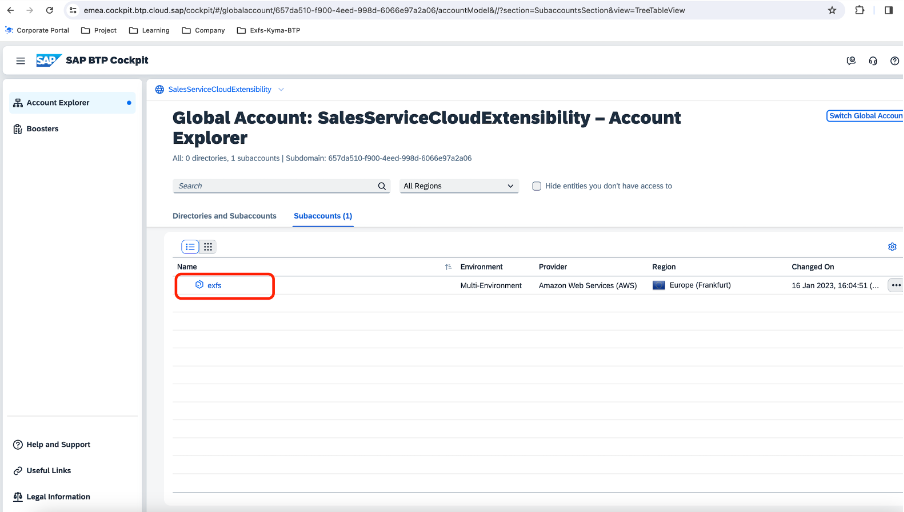
    * Go to Kyma Environment -> click on kubeconfigURL. This will download the kubeconfig file:\
    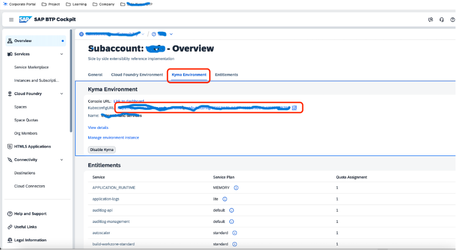
    * Rename the downloaded file to “config” (without any extension) and depending on the operating system, place the file in the following location:  \
    Mac OS: $HOME/.kube/ (Create .kube directory if not present already)\
    Windows: C:\Users\<user-name>\.kube\ (Create .kube directory if not present already) 

2. Create a namespace called "dev"(You can also create namespace with other names. However, if you create a namespace with a different name, kindly make sure the same name is updated in "vehicle-service.yaml" file in the code)

3. Create XSUAA/destination service instances\
Since our application uses destination to connect to services in CNS, we need to create service instance and service binding for both destination and xsuaa. (XSUAA will be used to fetch credentials required to connect to the destination service)
Please refer [this](https://blogs.sap.com/2022/07/12/the-new-way-to-consume-service-bindings-on-kyma-runtime/) to understand how services - destination service and xsuaa service are consumed in an application in kyma.
  * Add the SERVICE_BINDING_ROOT env variable into your deployment: https://github.tools.sap/fp-stakeholder-management/xsuaa-approuter/blob/main/approuter/helm/app1-app/templates/deployment.yaml#L91
  * Create a volume with your dest service binding secret: https://github.tools.sap/fp-stakeholder-management/xsuaa-approuter/blob/main/approuter/helm/app1-app/templates/deployment.yaml#L91
  * Create a volume mount with a path to the binding secret: https://github.tools.sap/fp-stakeholder-management/xsuaa-approuter/blob/main/approuter/helm/app1-app/templates/deployment.yaml#L69 \
  NOTE: Once you create XSUAA instance, a secret will be created which will have details like ClientID, clientSecret, tokenURL etc which will be needed in the following steps. **Kindly give the secret names as "destination-service-binding" and "xsuaa-service-binding" for destination and xsuaa services respectively**

4. Create Destinations in BTP:\
  There will be two Destinations -
    * First, used by buildapps to connect the application in kyma:

    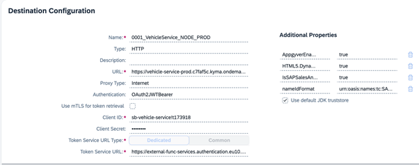  
      * **Type**: HTTP
      * **URL**: Application URL
      * **Authentication**: OAuth2JWTBearer
      * **ClientId, ClientSecret, Token Service URL**: You will get this info from the xsuaa instance secret created in the previous step. OAuth2JWTBearer destination type can help exchange the user JWT token into an OAuth2 bearer access token with the required scopes

   To allow an application to call another application, passing the user context, and fetch resources, the caller application(In our case, this is the build apps application) must pass an access token. In this authorization flow, the initial user token is passed to the OAuth server as input data. This process is performed automatically by the Destination service, which helps simplifying the application development: You only have to construct the right request to the target URL, by using the outcome (another access token) of the service-side automation.
    * Second, Used by the application in kyma to connect to service in CNS:
  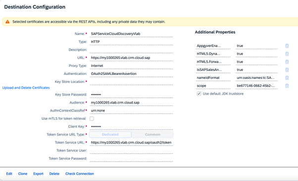 \
   OAuth2SAMLBearerAssertion authorisation flow allows for propagation of a user’s identity from our application deployed in kyma to the service we are trying to connect in Sales and Cloud Service.
5. Create Hana Database to instance
   * Follow [this](https://blogs.sap.com/2022/12/15/consuming-sap-hana-cloud-from-the-kyma-environment/) to consume HANA Database in Kyma
   * **This will create a Kubernetes secret from where we can get the details required to connect to the Database**
6. Create Kubernetes secrets
    * Create a Kubernetes secret file(with the name **vehicle-service-secrets**) to store sensitive data like db username/password and other application specific data.
    * The secret should contain the following:
      * **case_status_booked**: \<*Status code when case status is booked*>
      * **case_status_closed**: \<*Status code when case status is closed*>
      * **case_status_completed**: \<*Status code when case status is completed*>
      * **case_status_service_completed**: \<*Status code when case status service completed*>
      * **case_status_service_in_process**: \<*Status code when case status is service in process*>
      * **db_password**: \<*Database password. This is available in the secret that’s created in the above step*>
      * **db_user**: \<*Database username. This is available in the secret that’s created in the above step*>
      * **destination**: \<*Destination to which the application connects*>
      * **dropSchema**: \<*Drops the schema each time connection is being established. This option is useful during debug and development*>
      * **extension_field_jobcard_id**: \<*Job Card ID extension field*>
      * **extension_field_milometer**: \<*Milometer extension field*>
      * **extension_field_service_form_id**: \<*Service Form ID extension field*>
      * **extension_field_vehicle_number**: \<*Vehicle Number extension field*>
      * **logLevel**: \<*Sets the log level of the application*>
      * **synchronize**: \<*Indicates if database schema should be auto created on every application launch. This option is useful during debug and development*>
    * You will notice this secrets contains IDs for configurations done in sales and service cloud like extension fields, Case status. The reason being different IDs which is generated when fields are created. In our service code, we are refering to IDs maintained here in business logic.

7. Clone the service from - *git@github.com:SAP-samples/sales-and-service-cloud-extensions.git*

8. Prepare Deployment Description File\
   Based on our application specification, we define the following description file for deployment. This yaml file can be found inside k8s folder(in case of **Node Service**) and within root directory(in case of **Java Service**)

   NOTE: In API Rule, we have configured an access strategy to restrict access to the application. We will be using the JWT access strategy to protect endpoint(s) from unsolicited access.

9. Access to a container registry:\
To store the application image, access to a container registry(eg Docker hub) is required. 
   * For **Node Service**
     * The docker-image name has to be filled in the files "VehicleServiceExtensionSample/nodeJs/skaffold.yaml" and "VehicleServiceExtensionSample/nodeJs/k8s/vehicle-service.yaml"(Placeholders are provided in the files)
   * For **Java Service**
     * The docker-image name has to be filled in the files " skaffold.yaml" and "k8s-deployment-backend.yaml"

10. Install dependencies:
    * For **Node Service**
      * Do ```npm install``` in root directory
    * For **Java Service**
      * Do ```mvn clean install```  in root directory

11. Deploying the service to Kyma
    * For **Node Service**
      * Use "deploy.sh" (In root directory) to deploy the service to Kyma\
        * This is a script which does two things:
        * Build the application
        - Deploy to Kyma cluster using scaffold

           Run the command “bash deploy.sh”

    * For **Java Service**
      * Deploying the service to Kyma
        * below are the two commands:
        * Build the application – ```mvn clean install```
        * Deploy to Kyma cluster using scaffold – ```scaffold run```

Alternatively, please follow the steps below to deploy your service to Kyma:
* Build the application
*  Build docker image:
To create docker image we use the following docker file(This DockerFile is available in the root directory of the application):<br><br>
* For **Node Service**


* For **Java Service**<br><br>
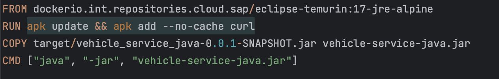

* Use command - ```docker build -t <docker-hub-account>/<image-name>:v1``` to build docker image based on the above dockerfile.This   command should be run in the same level where the DockerFile is present
*  Push the docker image to a container repository.\
If you are using docker hub to store the image we created in the previous step:
   * Log in to Docker using this command: ```docker login -u <docker-id> -p <password>```
   * Push the local image into the Docker Hub using command : ```docker push <docker-hub-account>/<image-name>:v1```
   * Deploy the application using the deployment description file created in step 5:\
```kubectl -n dev apply -f k8s/vehicle-service.yaml```

## Add Authentication 
This section shows how you can enable authentication for service and achieve user propagation between SAP Sales and Service Cloud and external applications.
* Enable BTP authentication in SAP Buildapps - https://blogs.sap.com/2022/07/01/using-btp-authentication-and-destinations-with-sap-appgyver/
This will create an xsuaa instance in BTP
* Create a destination with the following configuration for the build apps to connect: \
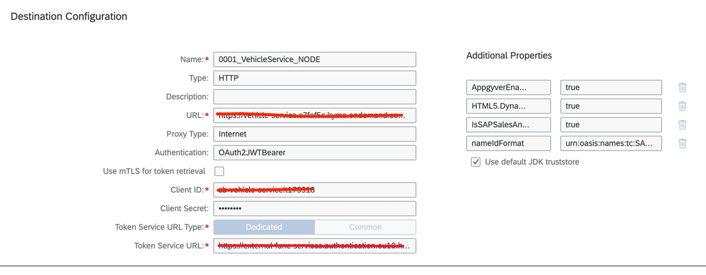
OAuth2JWTBearer destination type can help exchange the user JWT token into an OAuth2 bearer access token with the required scopes \
NOTE:
To get "Client ID", "Client Secret" and "Token Service URL", an XSUAA instance has to be created.\
To create an XSUAA instance, follow [this](https://help.sap.com/docs/btp/sap-business-technology-platform/using-sap-btp-services-in-kyma-environment). Once the service binding is created, it will create a Kubernetes secrets which will have the clientid, client secret and token service URL info.
* To allow an application to call another application, passing the user context, and fetch resources, the caller application(In our case, this is the build apps application) must pass an access token. In this authorization flow, the initial user token is passed to the OAuth server as input data. This process is performed automatically by the Destination service, which helps simplifying the application development: You only have to construct the right request to the target URL, by using the outcome (another access token) of the service-side automation.
* API rule definition for the service deployed in Kyma-
API rule CRD(custom resource definition) can offer a number of access strategies to help restrict access to exposed endpoints. In our case, we will be using the JWT access strategy as a way to protect an API rule endpoint(s) from unsolicited access.
To setup API rule CRD with access strategy:
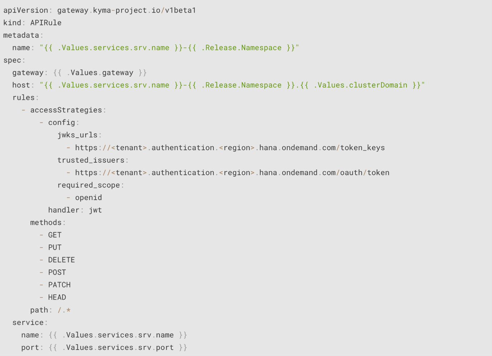
* With this API rule definition, the application hosted in kyma will have access to the user JWT token.\


## Running backend API using postman
Please follow below steps to run the APIs
 * Before testing the APIs, a case of type "Vehicle Service Case Type" needs to be created. In this case, a registered product needs to be added. Also, the extension field "Milometer" should be filled. This is mandatory else the ServiceForm API will fail.\
 Once this case is created, get the Case ID. To get the Case ID:
   * Open Developer Tools
   * Go to network tab
   * Filter by "case"
   * Open a case that satisfies the above conditions
   * The first network call will have the ID:\
   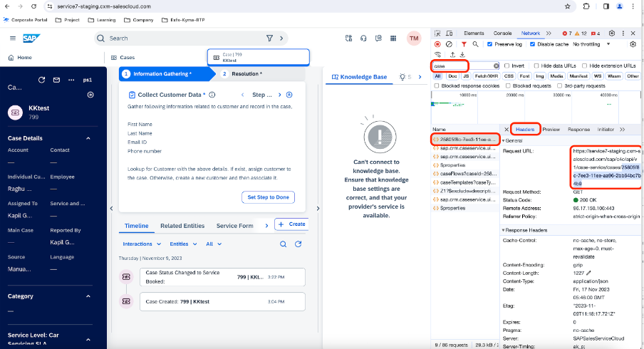
 *  Get the host of your deployed application: 
    * Go to your BTP subaccount:\
     
    * Go to kyma dashboard:\
    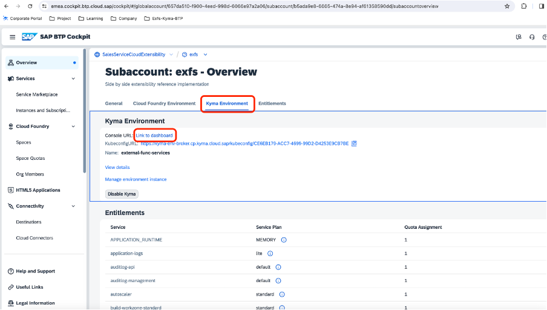 
    * Select your namespace:\
    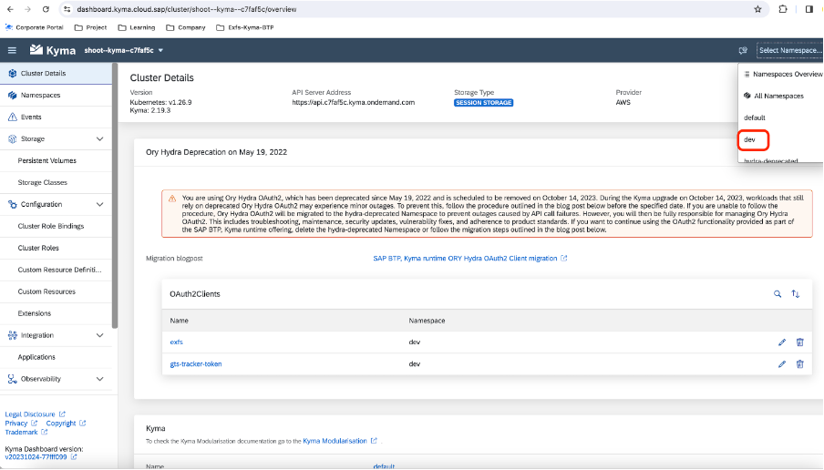 
    * Go to ApiRule -> select the host for your application:
    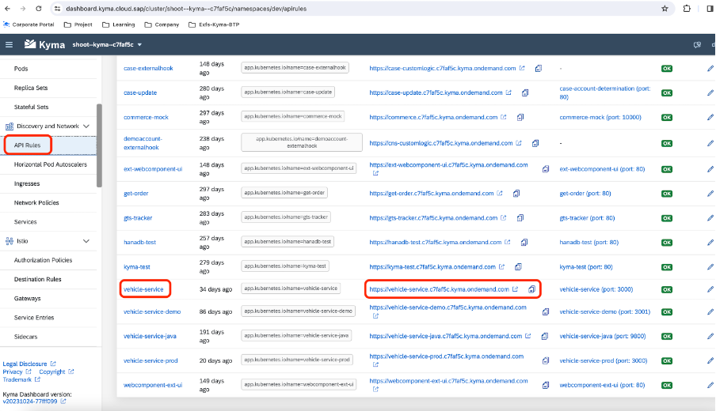
* Running APIs
  * Download the postman collection from [here](../Files/postmanCollection/ExFs.postman_collection.json). This JSON file needs to downloaded and imported to postman.\
   The sample application’s API is protected. This means that a valid JWT token is expected in the request. In postman you can set this authentication by following the below steps.
  * Go to collection level authorization and add the following configuration-\
  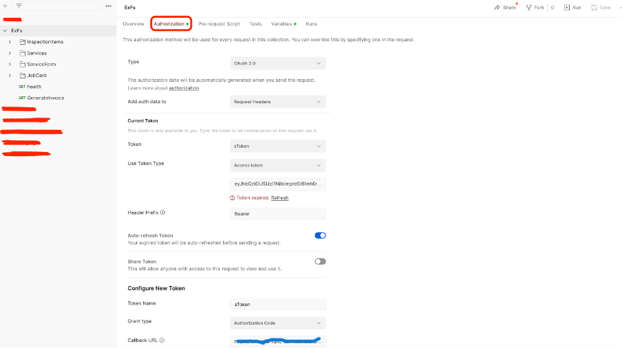
      * Type:  "OAuth 2.0"<br>
      * grant type - "Authorization Code" <br>
      * callback url - https://<*subdomain*>.launchpad.cfapps.<*region*>.hana.ondemand.com/login/ <br>
      * auth url -  https://<*subdomain*>.launchpad.cfapps.<*region*>.hana.ondemand.com /oauth/authorize?redirect_uri=auth url -  https://<*subdomain*>.launchpad.cfapps.<*region*>.hana.ondemand.com /oauth/authorize?redirect_uri=<br>
      * access token url -  https://<*subdomain*>.launchpad.cfapps.<*region*>.hana.ondemand.com /oauth/token<br>
      * client ID, client Secret: You will get these details in step 1 under [this](#download-and-deploy-service-in-kyma) section  
  * Create the following variables in the collection. Use the host from the previous step. No need to fill the other variables.\
  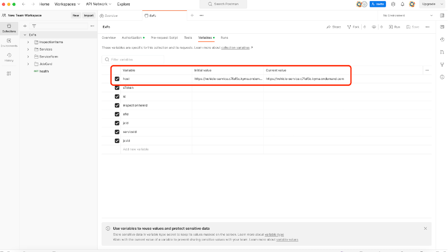
  * Create Inspection Item(Any number of inspection items can be created)\
  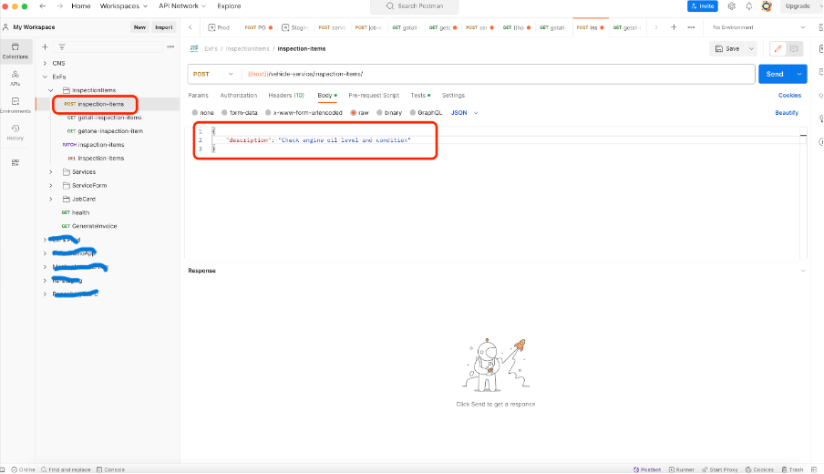 
  * Create Services(Any number of services can be created)
   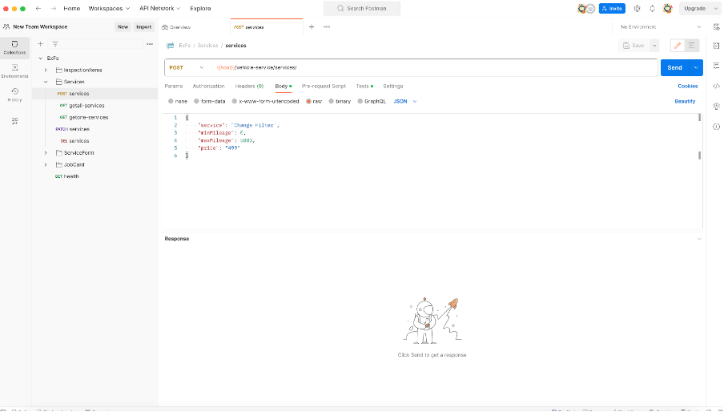  
  * Create ServiceForm (Use the caseId from the case created above): 
   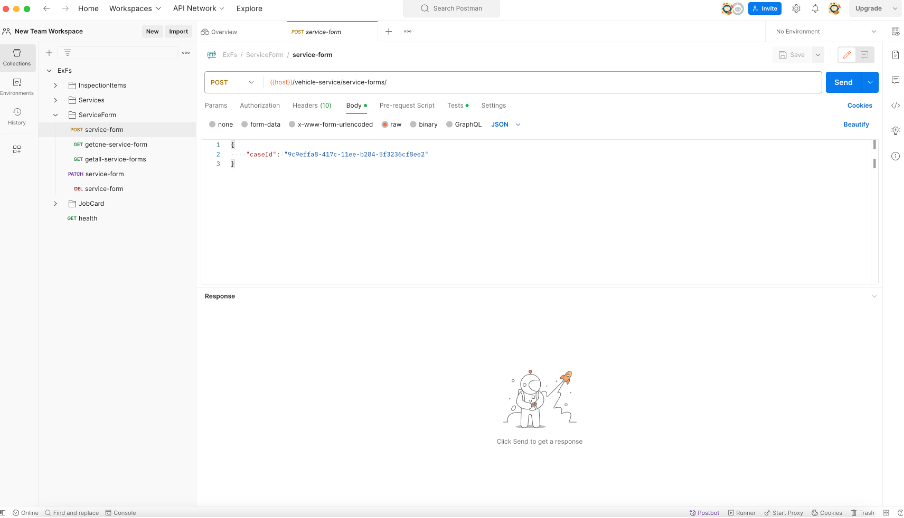
  * Update Service Form status to “Z02”(Booked) and select few related services and inspection items(by setting the field “isSelected” to true). Only for booked service forms with few selected services, we can create job card.\
  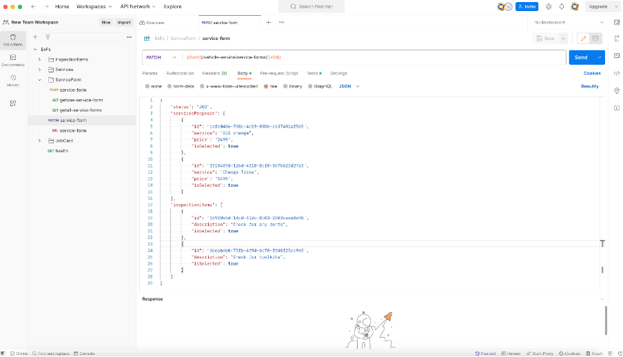
  * Create Job Card. Here 
  sourceid is the id of the serviceform created in the previous step. sourceType is service-form\
  

## Code Folder Structure
This section will help in understanding the code structure and important methods of service.

Details of "src" folder is below:

*cns-modules*

* It contains files/folders where code to connect with cns modules/api is written. Calling cns api is done via cloud SDK, which uses openAPI specs.
* In this reference, requirement involves connection with these cns entities- case, Individual customer, Accounts  and Registered product respectively .
* As shown in screenshot above, we have folder with same name. Customer folder includes connection with entities- Individual customer and Accounts.
* If you drill down, any one folder, for eg- case, you will find open-api folder which has specification file which is downloaded from API hub(https://api.sap.com/)
Here you will find specs for Case - https://api.sap.com/api/SalesSvcCloudV2_case/overview
*  Other TS files contains application logic to call CNS APIs via Cloud SDK. Example- cases.service.ts -> updateCase method. As name suggests, case is updated from here. Please notice the function call where destination and jwt Token is passed.

*Common* 

Contains files/folder for common/generic handling in application- like errors, exceptions, interceptors, middleware, base repository layer.

*Database*

It is to handle DB transaction logic.

*extension-modules*

It contains modules related to extension logic. All modules are based on standard pattern of controller, service, repository layer respectively.
Additionally, you will find dto and entities related files/folder.
Also, translation is taken care of. Refer the resource file added in i18n.

*Health*

To check the health of our service. This is mainly used by Kubernetes for any service health issue. 

*Logger*

Implementation of logger for our service. Logs can be checked in Kyma instance in BTP.

*Utils*
Contains files with util methods used across application.
