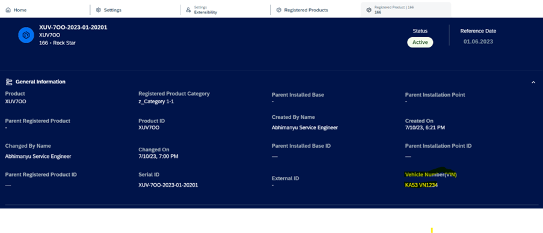
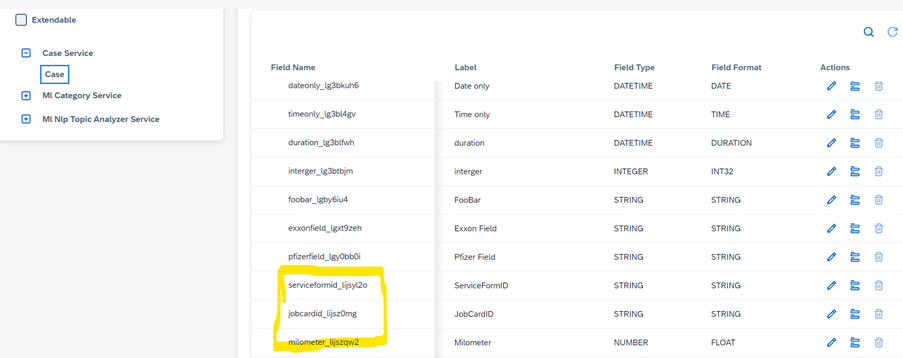
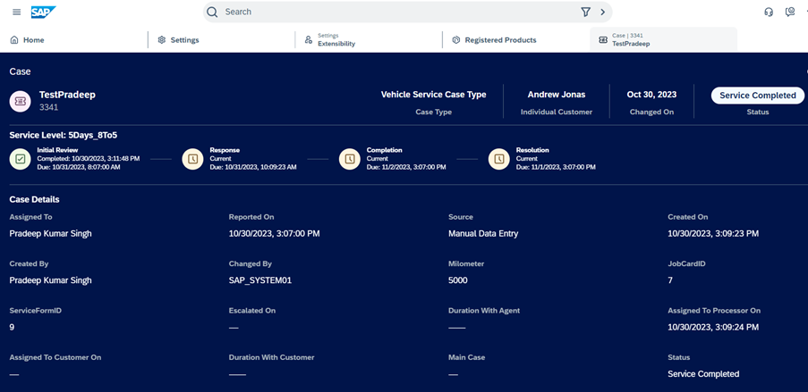
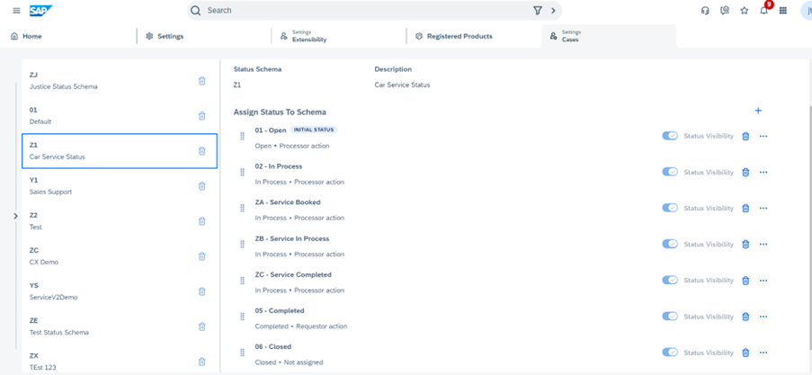

### Configurations in SAP Sales and Service Cloud
Before running this application, there are some configurations that needs to be done in SAP Sales and Service Cloud.
* Create and Add below extension fields
   * Vehicle Number (VIN Number) – Created for Registered Product entity

   

    This extension field is added in the header section of registered product object details.
  
   

   * Service Form ID – Created for Case
   * Job Card ID – Created for Case
   * Milometer- Created for case . All case related extension fields are added in the header section of case details.
   

    

  For more information, refer to [Create Extension Fields](https://help.sap.com/docs/CX_NG_SALES/ea5ff8b9460a43cb8765a3c07d3421fe/d3bdfac0c6b141c0bac27408c3ed159f.html?locale=en-US&q=create%20extension%20fields%20in%20sales%20and%20service%20cloud%20verion%202).
* Create Custom Case type
  * For this reference implementation – “vehicle service Case Type” case type needs to be created.
  * For more information, refer to [Create Custom Case Types](https://help.sap.com/docs/CX_NG_SVC/56436b4e8fa84dc8b4408c7795a012c4/016d3122e3d347feb329a3523b537ff3.html?locale=en-US&q=case%20type).
* Create custom case status
   * Create these three custom status for case - Service Booked , service In Progress and Service Completed respectively for custom case type - "vehicle service case type".

    

   * In reference scenario, when job card is created,case status is updated to Service Booked.When technician starts the service, case status is updated to service in progress.When technician completes the service, case status is updated to service completed. This logic is written in external service.
   * For more information, refer to [Create Custom Status](https://help.sap.com/docs/CX_NG_SVC/56436b4e8fa84dc8b4408c7795a012c4/be263fba54584ed6af0a670b4bfaafc2.html?locale=en-US&q=case%20status).

**Please make note of IDs of extension fields and custom status, as these will be used in service.**
